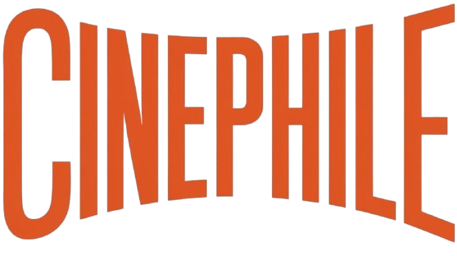

<div align="center">



# Cinephile

### Discover, save, track, and review the stories you love.

A modern full-stack movie and TV discovery platform built with **Flask** and **SQLite**.

<br />

<a href="https://www.linkedin.com/in/anant-jodha/">
  
</a>
<a href="#features"></a>
<a href="#getting-started"></a>

<br /><br />


</div>

---

## About the project

**Cinephile** is a responsive web application for discovering movies and TV shows while keeping a personal record of what you want to watch and what you have already seen.

Visitors can explore featured titles, search the catalog, filter by genre, view community reviews, and browse new releases. Registered members can build a watchlist, maintain their viewing history, and publish or update reviews.

The project runs locally without a separate database server. SQLite, the relational schema, indexes, and starter catalog are initialized automatically on the first request. The included catalog features titles such as **Inception**, **The Dark Knight**, **Interstellar**, **Breaking Bad**, and **Sherlock**.

## Features

### Discover

- Curated home page with featured and trending titles
- Separate movie and TV-show catalogs
- Search by title or description
- Filter titles by genre
- Sort by rating, release date, or title
- Browse genres and new releases
- Detailed title pages with ratings, runtime, maturity rating, and trailers

### Personalize

- Secure account registration and sign-in
- Personal watchlist
- Viewing-history journal
- Member dashboard with activity totals
- Create and update reviews with 1–10 ratings

### Built for every screen

- Responsive layouts for desktop, tablet, and mobile
- Accessible navigation and form labels
- Mobile navigation menu
- Reusable Jinja components and a consistent visual system
- Asynchronous watchlist and history actions

### Backend and security

- Password hashing with Werkzeug
- CSRF protection for state-changing requests
- Parameterized SQL queries
- HTTP-only and SameSite session cookies
- Safe local redirect validation
- Server-side input validation
- Relational constraints, foreign keys, and database indexes
- JSON health-check endpoint
- Automated route and member-flow tests

## Tech stack

| Layer | Technology |
|---|---|
| Frontend | HTML5, CSS3, JavaScript |
| Templates | Jinja2 |
| Backend | Python, Flask |
| Database | SQLite |
| Authentication | Flask sessions, Werkzeug password hashing |
| Production server | Gunicorn |
| Testing | Pytest |
| Packaging | Docker |

## Project structure

```text
Cinephile/
├── app.py                  # Routes, authentication, validation, and data access
├── schema.sql              # Tables, constraints, indexes, and starter catalog
├── requirements.txt        # Python dependencies
├── Dockerfile              # Container configuration
├── .env.example            # Environment-variable reference
├── static/
│   ├── css/
│   │   └── app.css         # Responsive design system
│   ├── js/
│   │   └── app.js          # Navigation and asynchronous actions
│   ├── images/             # Posters and background artwork
│   └── logo.png            # Cinephile logo
├── templates/
│   ├── base.html           # Shared page layout and navigation
│   ├── _card.html          # Reusable title card
│   ├── catalog.html        # Movies, TV shows, and new releases
│   ├── detail.html         # Title information and reviews
│   └── ...
├── tests/
│   └── test_app.py         # Automated application tests
└── instance/
    └── cinephile.db        # Generated automatically; ignored by Git
```

## Getting started

### Requirements

- Python 3.10 or newer
- Git, if you are cloning the repository

Python 3.12 or 3.13 is recommended. If several Python versions are installed on Windows, select one explicitly with the `py` launcher.

### Windows PowerShell

```powershell
git clone https://github.com/YOUR_USERNAME/cinephile.git
cd cinephile

py -3.13 -m venv .venv
.\.venv\Scripts\Activate.ps1

python -m pip install --upgrade pip
python -m pip install -r requirements.txt
python -m flask --app app run --debug
```

If PowerShell blocks virtual-environment activation, allow it for the current terminal session:

```powershell
Set-ExecutionPolicy -Scope Process -ExecutionPolicy Bypass
.\.venv\Scripts\Activate.ps1
```

### macOS and Linux

```bash
git clone https://github.com/YOUR_USERNAME/cinephile.git
cd cinephile

python3 -m venv .venv
source .venv/bin/activate

python -m pip install --upgrade pip
python -m pip install -r requirements.txt
python -m flask --app app run --debug
```

Open [http://127.0.0.1:5000](http://127.0.0.1:5000) in your browser.

> Replace `YOUR_USERNAME` with your GitHub username before publishing this README.

## Database

The application uses SQLite by default. On the first request, Cinephile creates:

```text
instance/cinephile.db
```

The schema is idempotent, so it can safely run again without duplicating the starter data. You can also initialize it manually:

```bash
python -m flask --app app init-db
```

To store the database elsewhere, set `DATABASE_URL`:

```env
DATABASE_URL=sqlite:////absolute/path/to/cinephile.db
```

## Environment variables

Copy `.env.example` to `.env` and adjust the values for your environment:

```env
SECRET_KEY=replace-with-a-long-random-value
DATABASE_URL=sqlite:///instance/cinephile.db
FLASK_DEBUG=1
PORT=5000
COOKIE_SECURE=false
```

For production, always use a stable random `SECRET_KEY`, serve the application over HTTPS, and set:

```env
COOKIE_SECURE=true
```

Do not commit `.env` or the generated database file.

> The project does not require environment variables for local development. Flask will not load `.env` automatically unless `python-dotenv` is installed, so either export the variables in your terminal or install `python-dotenv` if you want automatic `.env` loading. Always provide a stable `SECRET_KEY` in production.

## Run the tests

With the virtual environment activated:

```bash
python -m pytest -q
```

The test suite covers public routes, database initialization, registration, login, watchlist actions, viewing history, and authenticated pages.

## Production run

Gunicorn is included for Linux-based production environments:

```bash
export SECRET_KEY="$(python3 -c 'import secrets; print(secrets.token_hex(32))')"
gunicorn --bind 0.0.0.0:8000 --workers 2 app:app
```

Then open `http://localhost:8000`.

On Windows, use Flask's development server for local work. For a native Windows production deployment, use a Windows-compatible WSGI server such as Waitress; Gunicorn is intended for Unix-like environments.

### Docker

```bash
docker build -t cinephile .
docker run --rm -p 8000:8000 \
  -e SECRET_KEY="replace-with-a-secure-random-value" \
  cinephile
```

Open `http://localhost:8000`.

## Main routes

| Route | Purpose |
|---|---|
| `/` | Featured and trending titles |
| `/movies` | Searchable movie catalog |
| `/tv_shows` | Searchable TV-show catalog |
| `/genres` | Genre discovery |
| `/new_popular` | New and popular titles |
| `/reviews` | Latest community reviews |
| `/dashboard` | Member activity overview |
| `/mylist` | Personal watchlist |
| `/watch_history` | Viewing journal |
| `/health` | JSON application health check |

## Troubleshooting

### Flask or Werkzeug imports cannot be resolved

Install the dependencies inside the project virtual environment:

```powershell
python -m pip install -r requirements.txt
```

In VS Code, open **Python: Select Interpreter** and select:

```text
.venv\Scripts\python.exe
```

### `python -m venv` uses the wrong Python version

List installed versions:

```powershell
py -0p
```

Then create the environment with a supported version explicitly:

```powershell
py -3.13 -m venv .venv
```

### Reset the local database

Stop the server, delete `instance/cinephile.db`, and restart the application. The schema and starter catalog will be recreated automatically.

## Future improvements

- External movie-data API integration
- Poster uploads and administrator tools
- User profiles and social recommendations
- Pagination for larger catalogs
- PostgreSQL deployment option
- Email verification and password recovery

## Contributing

Contributions are welcome. Fork the repository, create a focused branch, and open a pull request with a clear description of your changes.

```bash
git checkout -b feature/your-feature
git commit -m "Add your feature"
git push origin feature/your-feature
```

---

<div align="center">

Built for people who always have one more title on their watchlist.

</div>

## 🤝 Connect With Me

<div align="center">

### 👨‍💻 Anant Jodha

<a href="https://www.linkedin.com/in/anant-jodha/">
  
</a>

</div>

---
